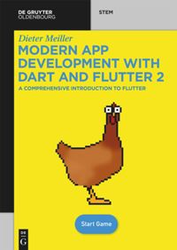

# Draw App

This is the sample code for the book about dart and flutter programming.

You have to allow file access on macos:
Change *draw_app/macos/Runner/DebugProfile.entitlements*
```
<key>com.apple.security.app-sandbox</key>
<false/>
```
It is written in flutter and dart.

There are no comments inside because all the explainations are inside the book.

The book is available at De Gruyter:

[Book](https://www.degruyter.com/document/doi/10.1515/9783110721331/html)

